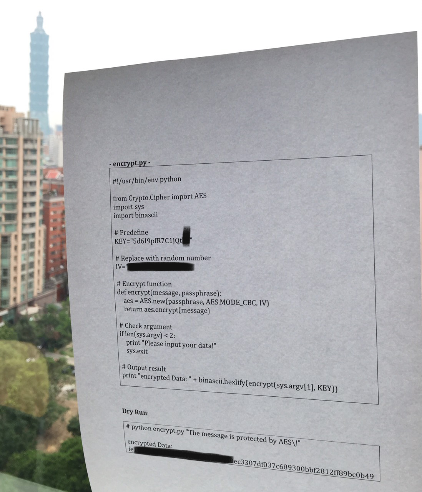

# Trend Micro CTF 2015: crypto200

----------
## Challenge details
| Contest        | Challenge     | Category  | Points |
|:---------------|:--------------|:----------|-------:|
| Trend Micro CTF 2015 | crypto200 | Crypto |    200 |

**Description:**
>*Category: Cryptography*
>
>*Points: 200*
>
>*Zip Password: image_q*
>
>*[Your small program has been drew by kid, some values are missed, but you feel you can restore it!](challenge/Q.zip)*
>
>*Please try to find the value of AES IV key.*

----------
## Write-up

The challenge archive contains a picture of a python program and some of its input values:



As we can see it is a simple program using AES in CBC mode to encrypt a string. We are provided with the known plaintext, part of the resulting ciphertext and part of the key (missing 2 bytes) and are tasked to recover the IV.

CBC mode is a block cipher mode of operation that feeds every previous ciphertext block (or the IV in the case of the first block) together with the plaintext block (in the form of a XOR operation) into the block cipher routine so as to make a ciphertext block depend on previously processed plaintext blocks.

If we take a look at the CBC mode decryption schematic:


We can see that if we have a corresponding ciphertext and known plaintext block pair we can derive the corresponding 'IV' (either the cipher IV for the first block or the previous ciphertext block for the other blocks) by simply XORing the result of cipherblock decryption and known plaintext.

Similarly, given a corresponding ciphertext and known plaintext block a (partially) unknown key and a (partially) known previous ciphertext block we can brute-force the key and select candidate keys based on the fact that if we decrypt the ciphertext block with our candidate key and XOR it with the known plaintext block the resulting block should match our known previous ciphertext block at the known offsets.

With these two tools we can reconstruct the cipher IV from our given data by first brute-forcing the two unknown bytes yielding (a set of) candidate keys. For each given candidate key we can reconstruct the first ciphertext block proceed to decrypt it with our candidate key and XOR it against our known first plaintext block to obtain a candidate IV.

[The following script](solution/crypto200_crack.py) does this for us:

```python
#!/usr/bin/env python
#
# Trend Micro CTF 2015
#
# @a: Smoke Leet Everyday
# @u: https://github.com/smokeleeteveryday
#

import string
import itertools
from Crypto.Cipher import AES

def xor_blocks(b1, b2):
  return "".join(chr(ord(x) ^ ord(y)) for x, y in zip(b1, b2))

def encrypt(m, p, iv):
  aes = AES.new(p, AES.MODE_CBC, iv)
  return aes.encrypt(m)

def decrypt_block(c, k):
  aes = AES.new(k, AES.MODE_ECB)
  return aes.decrypt(c)

def brute_block(c_block, p_block, known_iv, known_key_prefix):
  assert(len(p_block) == 16)

  # Candidate list
  candidates = []

  # Known key prefix
  brute_count = (16 - len(known_key_prefix))

  # Character set
  charset = [chr(x) for x in xrange(0x00,0x100)]

  # Brute-force
  for p in itertools.chain.from_iterable((''.join(l) for l in itertools.product(charset, repeat=i)) for i in range(brute_count, brute_count + 1)):
    candidate = known_key_prefix + p
    d = decrypt_block(c_block, candidate)
    t = True
    # Check whether known plaintext/known iv constraint holds
    for offset in known_iv:
      t = (t and (p_block[offset] == chr(ord(d[offset]) ^ ord(known_iv[offset]))))

    if(t == True):
      candidates.append(candidate)

  return candidates

# Known key fragment
known_key_prefix = "5d6I9pfR7C1JQt"
# Known plaintext
plaintext = "The message is protected by AES!"
# Ciphertext block 1
c_block_1 = "307df037c689300bbf2812ff89bc0b49".decode('hex')
# Known fragments of ciphertext block 0, organized by offset
known_iv = {
      0: "\xFE",
      15: "\xC3"
}

# Obtain candidate keys
candidate_keys = brute_block(c_block_1, plaintext[16:], known_iv, known_key_prefix)

# Try all candidate keys
for k in candidate_keys:
  # Obtain ciphertext block 0 as IV of ciphertext block 1
  c_block_0 = xor_blocks(decrypt_block(c_block_1, k), plaintext[16:])

  # Obtain IV given known ciphertext block 0, plaintext block 0 and key
  IV = xor_blocks(decrypt_block(c_block_0, k), plaintext[:16])
  print "[+]Candidate IV: [%s]" % IV
```

Which gives output;

```bash
$ ./crypto200_crack.py
[+]Candidate IV: [Key:rVFvN9KLeYr6]
`